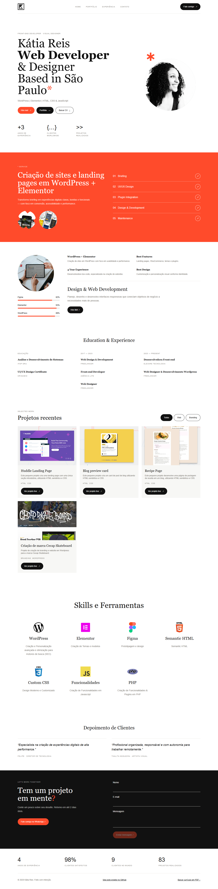

# Portfolio Kátia Reis

## Visão geral do portfólio
Este projeto consiste em um website de página única (*one-page*) desenvolvido para centralizar informações profissionais, acadêmicas e competências técnicas. O objetivo principal é permitir que recrutadores e potenciais clientes avaliem o perfil da profissional de forma rápida e eficiente, reduzindo o tempo de busca por informações dispersas em diferentes plataformas.

O sistema prioriza a **experiência do usuário (UX)** com um layout responsivo, carregamento ágil e navegação semântica, garantindo acessibilidade em computadores e dispositivos móveis.

### Sobre

Portfólio profissional de Kátia Reis, desenvolvedora front-end e visual designer. O projeto apresenta serviços, experiência, habilidades, depoimentos e projetos recentes desenvolvidos para a web.

### Identificação do Aluno

*   **Nome:** Kátia Reis
*   **Aluno** IFSP
*   **Disciplina:** Desenvolvimento Full Stack

### Tecnologias Utilizadas

## Tecnologias

O desenvolvimento foi realizado seguindo as restrições técnicas da primeira entrega, utilizando exclusivamente:

- HTML5 semântico;
- CSS3;
- Bootstrap 5;
- JavaScript;

*   **HTML5:** Utilização de tags semânticas para melhor SEO e acessibilidade.
*   **CSS3:** Estilização personalizada seguindo a identidade visual com tons de laranja coral (#FF4500) e fontes modernas (*Syne* e *Inter*).
*   **JavaScript:** Implementação de interações reais, como filtragem de projetos e validação de formulário.
*   **Bootstrap 5:** Framework utilizado para garantir a responsividade e componentes de interface modernos.

### Resumo das Funcionalidades
*   **Navegação Semântica:** Menu de acesso rápido às seções de Portfolio, Sobre e Contato.
*   **Vitrine de Projetos:** Galeria interativa com filtragem dinâmica por categoria via JavaScript.
*   **Download de Currículo:** Botão para download automático do currículo em formato PDF otimizado.
*   **Integração com WhatsApp:** Botão de chamada para ação (*CTA*) para contato direto e imediato.
*   **Formulário de Contato:** Validação de campos obrigatórios e formato de e-mail antes do envio.
*   **Design Responsivo:** Layout que se adapta fluidamente a qualquer tamanho de tela.

### Instruções para Executar o Projeto

1.  **Clone o repositório:** Baixe os arquivos para sua máquina local através do comando `git clone [https://github.com/devkatiareis/web-designer-landing-page]`.
2.  **Acesse a pasta:** Entre na pasta raiz do projeto (`portfolio/`).
3.  **Execução:** Abra o arquivo `index.html` em qualquer navegador moderno (Chrome, Firefox, Edge ou Safari).
4.  **Verificação:** Certifique-se de que as pastas `css/`, `js/` e `assets/` estejam no mesmo nível do `index.html` para que os estilos e scripts carreguem corretamente.

### Link da Versão Publicada

*   **Acesse aqui:** [https://devkatiareis.github.io/web-designer-landing-page/]

---


**Nota:** Este projeto foi desenvolvido seguindo a metodologia **Vibe Coding**, utilizando Inteligência Artificial como parceira na arquitetura e refinamento do código, mas mantendo a responsabilidade técnica e decisões de design centradas na engenharia de software.

## Visão geral

O site foi desenvolvido como uma página responsiva, com foco em:

- Desenvolvimento front-end;
- WordPress e Elementor;
- Design de interfaces e experiências digitais;
- Apresentação de projetos web e de branding;
- Contato direto via WhatsApp.

## Projetos apresentados

### Huddle Landing Page

Landing page desenvolvida com HTML e CSS.

### Blog preview card

Pequeno projeto de card de post de blog utilizando HTML semântico e CSS.

### Criação de marca Cecap Skateboard

Projeto de criação de branding e website em WordPress para a marca Cecap Skateboard.

## Estrutura do projeto

```text
/
├── index.html
├── README.md
├── css/
│   ├── style.css
    └── theme.css
├── js/
│   └── script.js
└── assets/
    ├── downloads/
    └── images/
└── docs/
    ├── documentacao.md
    └── projeto.md
```

## Como executar

1. Baixe ou clone os arquivos do projeto.
2. Abra o arquivo `index.html` em um navegador.
3. Para uma experiência mais próxima de um ambiente publicado, utilize um servidor local estático.

O projeto utiliza o Bootstrap 5 por CDN, portanto a conexão com a internet é necessária para carregar o framework no navegador.

## Personalização

As principais decisões visuais estão centralizadas no arquivo `theme.css`, por meio de variáveis CSS:

- Cores primária e de fundo;
- Cor do texto e textos secundários;
- Fontes de títulos e corpo;
- Raio das bordas e componentes.

Para alterar o tema visual de todo o site, edite os valores definidos em `:root` nesse arquivo.


### Screenshot do Projeto

*   

---

## Créditos

© 2024 Kátia Reis. Feito com intenção.
